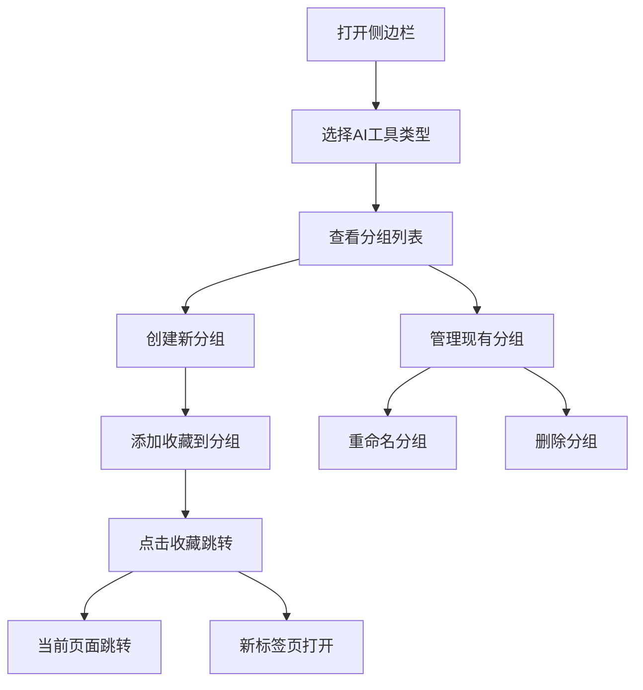

# AI工具分组管理插件 - 产品需求文档

## 1. 产品概述

本产品是一个Chrome侧边栏插件，专门解决AI工具（如ChatGPT、Claude等）缺乏分组管理功能的问题。通过提供统一的分组界面，帮助用户更好地组织和管理不同AI工具的对话内容。

插件的核心价值在于提升AI工具使用效率，减少用户在多个AI对话中切换时的困扰，类似于为AI工具提供一个通用的书签管理系统。

## 2. 核心功能

### 2.1 用户角色

本产品面向所有Chrome浏览器用户，无需注册登录，直接安装使用。

### 2.2 功能模块

我们的AI工具分组管理插件包含以下主要页面：

1. **侧边栏主界面**：AI工具类型选择、分组列表展示、快速操作按钮
2. **分组管理界面**：创建分组、重命名分组、删除分组
3. **收藏管理界面**：添加收藏、编辑收藏、删除收藏

### 2.3 页面详情

| 页面名称 | 模块名称 | 功能描述 |
|---------|---------|----------|
| 侧边栏主界面 | AI工具选择器 | 显示支持的AI工具类型（ChatGPT、Claude、Gemini等），支持切换选择 |
| 侧边栏主界面 | 分组列表 | 展示当前AI工具下的所有分组，支持展开收起 |
| 侧边栏主界面 | 收藏列表 | 显示每个分组下的收藏项目，支持点击跳转 |
| 侧边栏主界面 | 快速操作 | 提供新建分组、添加收藏等快捷按钮 |
| 分组管理界面 | 分组创建 | 输入分组名称，创建新分组 |
| 分组管理界面 | 分组编辑 | 重命名现有分组，支持实时保存 |
| 分组管理界面 | 分组删除 | 删除分组及其下所有收藏，需确认操作 |
| 收藏管理界面 | 收藏添加 | 手动添加当前页面或指定URL到分组 |
| 收藏管理界面 | 收藏编辑 | 修改收藏的标题和URL |
| 收藏管理界面 | 收藏删除 | 从分组中移除收藏项 |

## 3. 核心流程

**主要用户操作流程：**

1. 用户安装插件后，点击浏览器右侧的插件图标打开侧边栏
2. 在侧边栏顶部选择要管理的AI工具类型（如ChatGPT）
3. 点击"新建分组"按钮，输入分组名称创建分组
4. 在AI工具页面浏览时，点击"添加收藏"将当前对话添加到指定分组
5. 在侧边栏中点击收藏项直接跳转，Ctrl+点击在新标签页打开
6. 右键分组或收藏项可进行重命名、删除等管理操作

## 4. 用户界面设计

### 4.1 设计风格

- **主色调**：深色主题 (#1a1a1a) 配合白色文字，符合现代AI工具的设计风格
- **辅助色**：蓝色 (#0066cc) 用于强调和交互元素
- **按钮样式**：圆角矩形按钮，悬停时有渐变效果
- **字体**：系统默认字体，主要文字14px，标题16px
- **布局风格**：垂直卡片式布局，左侧图标右侧文字
- **图标风格**：使用简洁的线性图标，支持不同AI工具的品牌色彩

### 4.2 页面设计概览

| 页面名称 | 模块名称 | UI元素 |
|---------|---------|--------|
| 侧边栏主界面 | 工具选择器 | 下拉选择框，显示AI工具图标和名称，宽度300px |
| 侧边栏主界面 | 分组列表 | 可折叠的树形结构，每个分组显示名称和收藏数量 |
| 侧边栏主界面 | 收藏项 | 列表项显示标题、时间戳，悬停显示完整URL |
| 侧边栏主界面 | 操作按钮 | 固定在底部的"+ 新建分组"和"+ 添加收藏"按钮 |
| 分组管理界面 | 输入框 | 单行文本输入，支持回车确认，ESC取消 |
| 收藏管理界面 | 表单 | 标题输入框和URL输入框，带保存和取消按钮 |

### 4.3 响应式设计

插件采用固定宽度设计（320px），高度自适应浏览器窗口。支持鼠标和键盘操作，针对Chrome侧边栏环境优化交互体验。