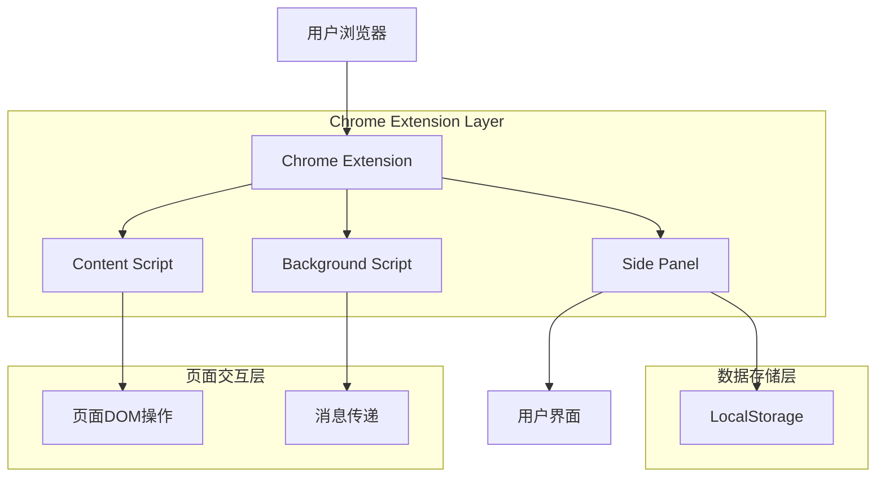
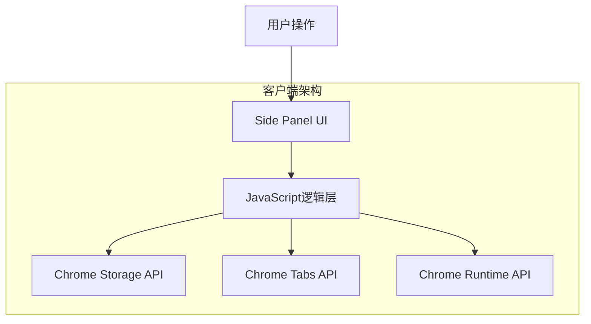
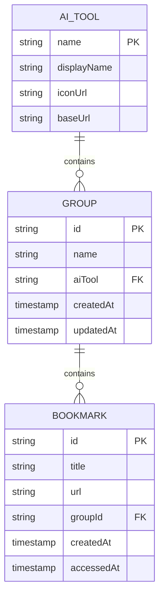

# AI工具分组管理插件 - 技术架构文档

## 1. 架构设计



## 2. 技术描述

- 前端：Chrome Extension Manifest V3 + HTML5 + CSS3 + Vanilla JavaScript
- 存储：Chrome LocalStorage API
- 通信：Chrome Extension Message Passing API

## 3. 路由定义

| 路由 | 用途 |
|------|------|
| /sidepanel.html | 侧边栏主界面，显示AI工具选择和分组管理 |
| /popup.html | 弹出窗口界面（备用），提供快速操作入口 |
| /options.html | 设置页面，配置插件选项和数据导入导出 |

## 4. API定义

### 4.1 核心API

**消息传递API**
```javascript
// 获取当前页面信息
chrome.runtime.sendMessage({
  action: 'getCurrentPageInfo'
})
```

请求参数：
| 参数名称 | 参数类型 | 是否必需 | 描述 |
|---------|---------|---------|------|
| action | string | true | 操作类型标识 |

响应参数：
| 参数名称 | 参数类型 | 描述 |
|---------|---------|------|
| url | string | 当前页面URL |
| title | string | 当前页面标题 |
| aiTool | string | 识别的AI工具类型 |

**数据存储API**
```javascript
// 保存分组数据
chrome.storage.local.set({
  'aiGroups': groupsData
})
```

请求参数：
| 参数名称 | 参数类型 | 是否必需 | 描述 |
|---------|---------|---------|------|
| aiGroups | object | true | 分组数据对象 |

响应示例：
```json
{
  "chatgpt": {
    "工作相关": [
      {
        "id": "1",
        "title": "代码优化讨论",
        "url": "https://chat.openai.com/c/abc123",
        "timestamp": 1703123456789
      }
    ],
    "学习笔记": []
  },
  "claude": {
    "写作助手": []
  }
}
```

## 5. 服务器架构图

由于Chrome插件运行在客户端，无需服务器架构。所有数据处理和存储都在浏览器本地完成。



## 6. 数据模型

### 6.1 数据模型定义



### 6.2 数据定义语言

**LocalStorage数据结构**

```javascript
// AI工具配置
const AI_TOOLS_CONFIG = {
  'chatgpt': {
    name: 'ChatGPT',
    displayName: 'ChatGPT',
    iconUrl: 'icons/chatgpt.png',
    baseUrl: 'https://chat.openai.com',
    urlPattern: /^https:\/\/chat\.openai\.com/
  },
  'claude': {
    name: 'Claude',
    displayName: 'Claude AI',
    iconUrl: 'icons/claude.png',
    baseUrl: 'https://claude.ai',
    urlPattern: /^https:\/\/claude\.ai/
  },
  'gemini': {
    name: 'Gemini',
    displayName: 'Google Gemini',
    iconUrl: 'icons/gemini.png',
    baseUrl: 'https://gemini.google.com',
    urlPattern: /^https:\/\/gemini\.google\.com/
  }
};

// 分组数据结构
const GROUPS_DATA_STRUCTURE = {
  // AI工具名称作为key
  'chatgpt': {
    // 分组名称作为key
    '工作相关': [
      {
        id: 'bookmark_uuid_1',
        title: '代码优化讨论',
        url: 'https://chat.openai.com/c/abc123',
        createdAt: 1703123456789,
        accessedAt: 1703123456789
      }
    ],
    '学习笔记': [],
    '日常聊天': []
  },
  'claude': {
    '写作助手': [],
    '翻译工作': []
  }
};

// 用户设置
const USER_SETTINGS = {
  defaultAiTool: 'chatgpt',
  sidebarWidth: 320,
  theme: 'dark',
  autoDetectAiTool: true,
  showTimestamp: true
};
```

**初始化数据**
```javascript
// 插件安装时初始化默认数据
chrome.runtime.onInstalled.addListener(() => {
  chrome.storage.local.set({
    'aiGroups': {},
    'userSettings': USER_SETTINGS,
    'version': '1.0.0'
  });
});
```